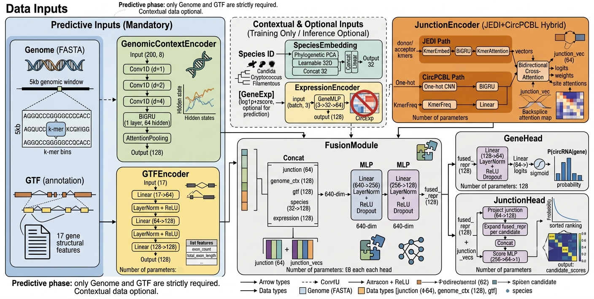

# 🍄 mycoCirc — Pan-Fungi CircRNA Foundation Model

> *myco* (fungus) + *Circ* (circular RNA) — a multi-modal foundation model for end-to-end circRNA prediction from fungal genomes.

**Author:** Yukkikou ([xueyanhu@pku.edu.cn](mailto:xueyanhu@pku.edu.cn))

[]()
[]()


*Figure 1: mycoCirc model architecture — multi-modal fusion of genome sequence, gene annotation, and circRNA metadata.*

**mycoCirc** is a multi-modal deep learning model that predicts **which genes produce circular RNAs (circRNAs)** and **which backsplice junction is most likely**, directly from a fungal genome sequence and gene annotation.

Unlike existing single-modal methods (JEDI, CircPCBL), mycoCirc integrates **five distinct modalities** during pre-training and fine-tuning. The model is pre-trained on 22 fungal strains spanning three major taxonomic groups (Candida, Cryptococcus, Filamentous) and demonstrates strong **cross-species generalization**: a model fine-tuned on one group can predict circRNA genes in phylogenetically related fungal species not seen during training, including entirely unseen genera. This makes mycoCirc applicable to a broad range of fungal species beyond the original training set.

---

## Architecture Overview

```
Gene-level input:
  GTF  (gene structure)  ──→ GTFEncoder ──┐
  Species ID             ──→ SpeciesEmb ───┤
  Genome window (10 kb)  ──→ GenomicCtxEnc ─┼─→ FusionModule ─→ GeneHead → P(circRNA|gene)
  [FT] CircExp           ──→ ExpEncoder ───┘
  [FT] GeneExp           ──→ ExpEncoder ───┘

Junction-level (per gene):
  All exon 5' boundaries  ──→ k-mer embed → BiGRU → k-mer attn → donor vectors (N_d)
  All exon 3' boundaries  ──→ k-mer embed → BiGRU → k-mer attn → acceptor vectors (N_a)
                                    ↓
                    Bidirectional cross-attention (JEDI core)
                          (donor↔acceptor pairwise scores)
                                    ↓
                    Final attention pooling → junction vector → fusion
```

### Components

| Component | Dim. | Description |
|-----------|------|-------------|
| **GenomicContextEncoder** | 128 | Dilated CNN + BiGRU on GC/k-mer profile bins of the ±5 kb gene window |
| **GTFEncoder** | 128 | MLP on 17 gene-structure features (exon count, intron length, CDS, etc.) |
| **JunctionEncoder** | 64 | JEDI (BiGRU + cross-attention) + CircPCBL (CNN-BiGRU + GLT) hybrid |
| **SpeciesEmbedding** | 32 | Phylogenetic PCA + learnable embedding (21 species) |
| **ExpressionEncoder** | 64 | log1p + z-score of CircExp & GeneExp (fine-tuning only) |
| **FusionModule** | 128 | Concat-MLP: project each modality, concatenate, refine |
| **GeneHead** | → 1 | Linear → sigmoid → P(circRNA\|gene) |
| **JunctionHead** | → scores | MLP scoring of candidate exon pairs (backup ranking) |

**Total parameters:** 775,858

---

## Training Protocol

### Two-Stage Pre-training

| Stage | Epochs | Trainable Modules | Loss |
|-------|--------|-------------------|------|
| **Stage 1** | 50 | GTFEncoder + GenomicCtxEncoder + Fusion + GeneHead | BCE(gene) |
| **Stage 2** | 100 | All (unfreeze JunctionEncoder) | BCE(gene) + BCE(junction) |

### Fine-tuning (per taxonomic group)

- **5-fold cross-validation** by strain: train on N-1 strains, validate on 1
- Best fold model → evaluate on held-out test strain
- Two modes:
  - **Mode A** (Genome+GTF): no expression data needed
  - **Mode B** (+GeneExp): with host gene expression

### Test Strains

| Group | Training Strains | Held-out Test |
|-------|-----------------|---------------|
| **Candida** | *C. albicans*, *C. tropicalis*, *C. glabrata* (×2), *P. kudriavzevii*, *S. cerevisiae* | **_C. auris_** |
| **Cryptococcus** | *C. neoformans* var. *grubii* (×2), *C. floricola*, *C. gattii* (×2), *C. laurentii* | **_C. neoformans_ var. _neoformans_** |
| **Filamentous** | *F. proliferatum*, *F. dimerum*, *N. crassa*, *A. fumigatus*, *P. chrysogenum* | **_F. venenatum_** |

---

## Results Summary

### Cross-species circRNA Prediction (AUROC)

| Method | Candida | Cryptococcus | Filamentous |
|--------|:-------:|:------------:|:-----------:|
| **mycoCirc** (Genome+GTF) | **0.6985** | **0.6902** | **0.6976** |
| mycoCirc (+GeneExp) | 0.4526 | 0.5698 | 0.7227 |
| From-scratch (no pretrain) | 0.4992 | 0.5411 | 0.5053 |
| JEDI | 0.5057 | 0.5341 | 0.5656 |
| CircPCBL | 0.5329 | 0.4925 | 0.4927 |

### Key Findings

- **Pre-training is essential**: from-scratch collapses to ~random (AUROC ~0.50–0.54)
- **GTFEncoder is the dominant modality**: removing it drops AUROC by 0.06–0.14
- **JunctionEncoder contributes modestly**: consistent +0.01–0.04 AUROC across groups
- **Expression helps within-group but not cross-species**: Mode B inconsistent
- **Cross-species generalization** to unseen *Talaromyces marneffei* (PM1): AUROC 0.6955

### Junction Prediction Accuracy

*(Results from `results/interpretability/junction_topk.tsv` — see below)*

---

## Quick Start

📖 完整教程（安装 → 下载权重 → 运行预测 → 结果解读）见 **[QUICKSTART.md](QUICKSTART.md)**。

快速上手：

```bash
# 1. 预训练权重位于 model_weights/ 目录
ls model_weights/

# 2. 运行预测（需要 genome.fa + annotation.gtf）
python scripts/predict.py \
    --genome genome.fa \
    --gtf annotation.gtf \
    --checkpoint model_weights/mycoCirc_filamentous.pt \
    --config config/default.yaml \
    --output predictions.tsv

# 3. 查看结果（p_circ ≥ 0.5 为预测阳性）
head predictions.tsv
```

---

## Architecture Overview

### Requirements

```
Python  ≥3.9
PyTorch ≥2.0 (CUDA recommended)
NumPy, Pandas, scikit-learn
Biopython, pyfaidx
matplotlib, seaborn
tqdm, pyyaml, scipy
```

### 1. Prepare Data

Ensure `all_lib_model_full.tsv` is in the project root with correct paths to:
- Reference genome FASTA files
- Gene annotation GTF files
- CircRNA metadata CSV (from CIRIquant or similar)
- Optional: CircExp BSJ count and GeneExp count matrices

```bash
# Validate the TSV
python scripts/parse_tsv.py
```

### 2. Pre-train

```bash
# Single GPU
python train/pretrain.py --config config/default.yaml

# Multi-GPU
accelerate launch train/pretrain.py --config config/default.yaml
```

### 3. Fine-tune

```bash
# Fine-tune with 5-fold CV for a specific group
python train/finetune.py --group Candida \
    --pretrained checkpoints/pretrain/best.pt \
    --config config/default.yaml

# Fine-tune without pre-training (from scratch)
python train/finetune.py --group Candida \
    --from-scratch --config config/default.yaml
```

### 4. Evaluate

```bash
# Evaluate on held-out test strain
python scripts/evaluate_junction.py \
    --config config/default.yaml \
    --checkpoint-dir checkpoints/finetune

# Test on completely unseen species
python scripts/test_pm1.py \
    --config config/default.yaml \
    --checkpoint-dir checkpoints/finetune
```

### 5. Interpretability

```bash
# Run full interpretability pipeline
python scripts/run_interpretability.py \
    --config config/default.yaml \
    --checkpoint-dir checkpoints/finetune \
    --fig-dir figures
```

### SLURM

```bash
sbatch scripts/run_pretrain.slurm
sbatch --array=1-3 scripts/run_finetune.slurm
sbatch scripts/run_interpretability.slurm
```

---
| `results/interpretability/feature_importance.tsv` | GTF feature importance |
| `results/interpretability/motif_enrichment.tsv` | Sequence motif enrichment |

---

## Comparison with Existing Methods

| Feature | mycoCirc | JEDI | CircPCBL |
|---------|----------|------|----------|
| Multi-modal | ✅ (5 modalities) | ❌ (sequence only) | ❌ (sequence only) |
| Cross-species | ✅ (22 fungi strains) | ❌ (species-specific) | ❌ (plant-trained) |
| Pre-training | ✅ (two-stage) | ❌ | ❌ |
| Junction ranking | ✅ (cross-attention) | ✅ | ❌ |
| Interpretability | ✅ (IG + attention) | ❌ | ❌ |
| Open-source | ✅ | ✅ | ✅ |

---

## Citation

If you use mycoCirc in your research, please cite:

```
@software{mycoCirc2026,
  author = {Xueyan Hu},
  title = {mycoCirc: A Multi-modal Foundation Model for Pan-Fungal circRNA Prediction},
  year = {2026},
  url = {https://github.com/yukkikou/mycoCirc}
}
```

### References

J.-Y. Jiang et al. JEDI: circular RNA prediction based on junction encoders and deep interaction among splice sites. *Bioinformatics*, 37(Supplement 1):i289–i298, 2021.

P. Wu et al. CircPCBL: Identification of Plant CircRNAs with a CNN-BiGRU-GLT Model. *Plants*, 12(8):1652, 2023.

---

## License

This project is for academic research purposes. See `LICENSE` for details.
